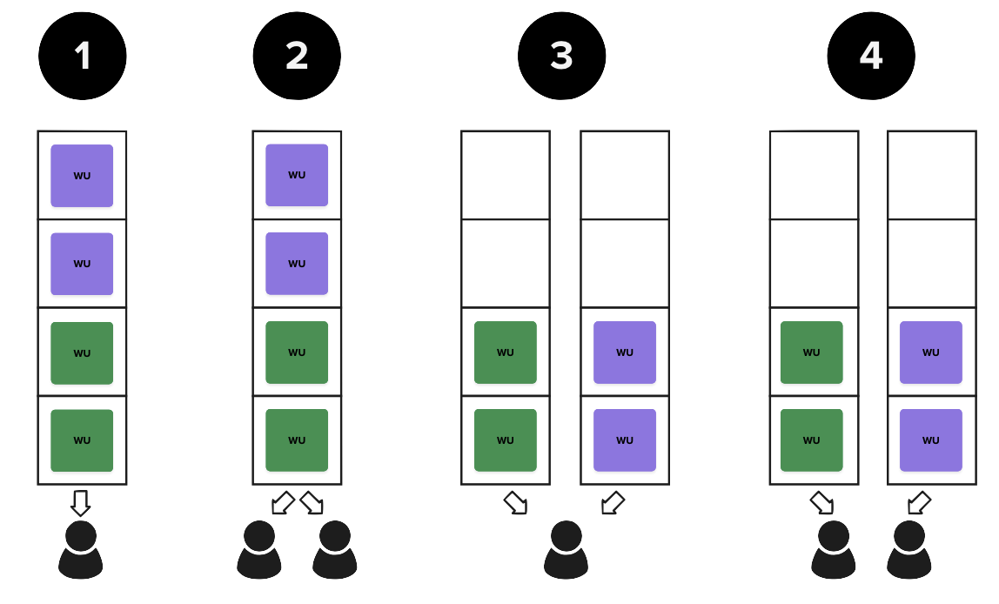

# caveat

> This place is not a place of honor... no highly esteemed deed is commemorated here... nothing valued is here.

<div style="text-align: right;"><a href="https://en.wikipedia.org/wiki/Long-term_nuclear_waste_warning_messages">Long-term nuclear waste warning messages</a></div>

<br/>

This repository neither pretends nor aspires to be a work of art. It does the thing it does, mostly.

# exploring job processing systems

Designing, developing, testing, and maintaining job processing systems is expensive in time. Getting the *model* wrong means that the implementation, no matter how good, will always be fundamentally unfit for purpose. A job processing system that is unfit for purpose leads to disruptions of user experience, either as soft failures (where a system slows down or performs poorly) or hard failures (where the system crashes or loses data). All of these are considered incidents, and carry expensive diagnostic and recovery processes with them. 

("Expensive" means "an entire team is typically stopped and focused on resolving an incident, sometimes for days, while a root cause is ascertained, and the full impact to users is described.")

Because we want to avoid failures in our production systems, a good design process considers the system's needs under light, average, and heavy/extreme load, and we evaluate the model's behavior under these conditions. We can reason about these things (and even formally prove properties of our systems, if we're feeling feisty), but we can also [simulate](https://greenteapress.com/wp/modsimpy/) them. This is often easier, faster, and perhaps more appropriate in an agile, applied context. 

## abstractions FTW

Should we use one queue or two? One worker or two? These questions can be evaluated *in the abstract*. The amount of time it takes to run a query or store the result will be the same regardless of the model. Therefore, we can *reason* about the performance of our models without ever writing a line of code. Assume we have two jobs we want to complete, each of which contains two units of work:



1. **One worker, one queue**: If we have four units of work on the queue, it will take four units of time to complete all the jobs.
2. **Two workers, one queue**: With four units of work, the entire queue will empty in two units of time: more workers means the work gets done faster.
3. **One worker, two queues**: This does not change the amount of time it takes to complete all of the work, but it does impact the perception of how long it takes to complete individual jobs. If we put one job on each queue, the owners of those jobs will think it took *more* time to complete the work; this configuration *appears* slower (on a job-by-job basis) to *some* submitters/users when compared to other configurations.
4. **Two workers, two queues**: All four units of work complete in two units of time, *and* the owners of the work believe they were prioritized, because each job completed in two units of time.

## modeling systems

We can model job processing systems in a small number of lines of code. This makes it possible to experiment with *models* as opposed to *implementations*. This allows us to propose a model, and then ask questions about fundamental properties of job processing systems, like **fairness**, **throughput**, **utilization rate**, **average wait time in queue**, **average wait time in system**, and other properties that ultimately are measures that impact the users real and perceived experience with the system.

Examples of the kinds of questions we can and should ask at the modeling stage:

1. How does the system perform if small jobs come in infrequently?
   1. Large jobs?
2. How does the system perform if small and large jobs come in regularly?
   1. What will the user's experience be if they own the small jobs? 
   2. The large jobs?
3. How does the system perform if someone accidentally submits the same job 10,000 times?
   1. What if it is a small job?
   2. Large?
4. If the model scales dynamically, what are the properties of the system...
   1. when it is contracted? 
   2. When it is at it's maximum expansion?
5. What happens if we experience a 2x growth; does the model hold up?
   1. 10x?
   2. 100x?
6. Can we, with our model, predict resource needs?
   1. Are there simplifications that have marginal impact on user experience but significant impact on cost reduction?
   2. Are there improvements that have significant impact on user experience but minimal impact on cost?

None of these questions require us to actually *build* the system in question. A good model lets us rapidly develop test scenarios (ideally grounded in anticipated and extreme cases of real-world user behavior), test those scenarios, and evaluate how our model will perform under those conditions. If the model performs poorly... *any system we build based on that model will also perform poorly*.

## homework

This folder contains one hacked-together example of a system of queues and workers. It is based on [SimPy](https://simpy.readthedocs.io/en/latest/), a discrete-event simulation framework. This means it does not concern itself with real notions of time, but instead models the world as a series of abstract events. We can then count the number of clock ticks (also events) that it takes to work through a simulation, and in doing so, evaluate system behavior and performance in a consistent, (possibly) repeatable/deterministic manner, even if it is abstracted from the realities of the world.

The simulation, as constructed, allows us to specify 1) the number of queues, 2) the number of workers, and 3) the number of work units on each queue at the start. The simulation then runs the workers round-robin. In a given clock-tick, a worker pulls a unit of work from the queue and completes it. The next clock tick, the worker moves on to the next queue, repeating the process. 

Workers do not, in this simulation, skip empty queues; they sit idle for a clock tick. (Why? Because the simulation was put together in a hurry. Hence, the model is *not optimal*, and were we to improve this particular behavior, we should be able to observe it in quantiatively.)


### set up the environment

I usually like to containerize applications. I skimped.

The makefile creates a venv and installs requirements.

```bash
> make setup
> source venv/bin/activate
> python sim1.py
```

### explore the simulations

There are 9 simulations pre-configured. To run them:

```bash
python sim1.py <simulation number> <is-noisy?>
```

The noisy parameter determines how much printing happens. "t" or "true" will print more detail; "f" or "false" will just print the results.

```bash
python sim1.py 1 t
```

runs the first simulation.


### simulation output

```
1 queue, 1 worker, 10 WUs
--------------
Adding J[0]WU[0] to Queue[0]
Adding J[0]WU[1] to Queue[0]
Adding J[0]WU[2] to Queue[0]
Adding J[0]WU[3] to Queue[0]
Adding J[0]WU[4] to Queue[0]
Adding J[0]WU[5] to Queue[0]
Adding J[0]WU[6] to Queue[0]
Adding J[0]WU[7] to Queue[0]
Adding J[0]WU[8] to Queue[0]
Adding J[0]WU[9] to Queue[0]
[0] Working J[0]WU[0] from Queue[0]
[1] Working J[0]WU[1] from Queue[0]
[2] Working J[0]WU[2] from Queue[0]
[3] Working J[0]WU[3] from Queue[0]
[4] Working J[0]WU[4] from Queue[0]
[5] Working J[0]WU[5] from Queue[0]
[6] Working J[0]WU[6] from Queue[0]
[7] Working J[0]WU[7] from Queue[0]
[8] Working J[0]WU[8] from Queue[0]
[9] Working J[0]WU[9] from Queue[0]

Simulation time[10]
Job[0] Duration[10]
```

The simulation prints the number of queues, workers, and total work units being computed.

When `noisy=True`, we see details. First, we see which jobs and work units are added to which queues. For example:

`Adding J[0]WU[7] to Queue[0]`

means "we are adding work unit 7 of job 0 to queue 0." In my haste, I counted from zero instead of one, so the "zeroth queue" is really the "first queue."

Then, we can see the simulation running.

```
[0] Working J[0]WU[0] from Queue[0]
[1] Working J[0]WU[1] from Queue[0]
[2] Working J[0]WU[2] from Queue[0]
```

First, we see the clock tick. On clock tick 0, work unit 0 from job 0 was pulled and worked from queue 0. Then, in the next clock tick, WU 1 was worked... and so on. 

If we have multiple workers, the output will look more like this:

```
[0] Working J[0]WU[0] from Queue[0]
[0] Working J[0]WU[1] from Queue[0]
[1] Working J[0]WU[2] from Queue[0]
[1] Working J[0]WU[3] from Queue[0]
```

Here, we see that in clock tick 0, there were two units of work completed: WUs 0 and 1 were both worked in a single clock tick, because there were two workers doing work. 

At the end, a summary is printed:

```
Simulation time[10]
Job[0] Duration[10]
```

We get the total time (in abstract clock ticks) for the simulation, and the amount of time each individual job took. In the case of 1 queue, with 1 worker, and one job of 10 WUs, it will take 10 clock ticks to complete all of the work.

### simulations included


The noisy parameter determines how much printing happens. "t" or "true" will print more detail; "f" or "false" will just print the results.

```bash
python sim1.py 1 t
```

runs the first simulation. You can run any of the built-in simulations by passing the numbers 1-9 to the script as the first parameter. Feel free to add more simulations.

1. 1 queue, 1 worker, 10 work units
2. 1q2w 10WU (abbreviating 1 queue, 2 workers, 10 work units)
3. 1q5w 10WU
4. 2q1w, 10WU per queue
5. 1q1w, two jobs of 10WU each
6. 2q1w, two jobs of 10WU each
7. 2q2w, two jobs of 10WU each
8. 3q1w, three jobs of 10WU each
9. 1q, 3w, three jobs of 100,00 WU, 1000 WU, and 10000 WU

#### thought questions

Run each simulation. For each simulation, consider...

1. What is the total time?
2. How long does each job take?
3. If you change the number of workers, how does that impact the simulation?
4. If you change the number of queues?
5. ...

And, for double-extra bonus fun: can you set up a simulation that starts to look like your system? (This initial simulation does not (yet) have the ability to inject work into the queues at specific times... that would let us model more authentic scenarios.)
